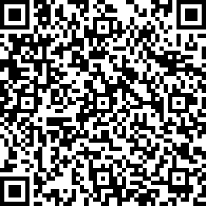

# React QRcode PIX

Objetivo deste pacote é a de facilitar o recebimento de pagamentos com PIX em aplicações React. Gerando o Qrcode estático para pagamento.

O *payload* do qrcode foi desenvolvido seguindo os documentos oficiais do BACEN:

 - [ManualBRCode.pdf](https://www.bcb.gov.br/content/estabilidadefinanceira/spb_docs/ManualBRCode.pdf)
 * [II_ManualdePadroesparaIniciacaodoPix.pdf](https://www.bcb.gov.br/content/estabilidadefinanceira/pix/Regulamento_Pix/II_ManualdePadroesparaIniciacaodoPix.pdf)

## 🚀 Instalação

Para instalar no seu projeto utilize o comando abaixo:

```
npm install react-qrcode-pix
```

## 🛠️ Configuração

Formatos válidos de chave PIX:

 - EMAIL: fulano_da_silva.recebedor@example.com
 - CPF: 12345678900
 - CNPJ: 00038166000105
 - TELEFONE: +5561912345678
 - ALEATORIA: 123e4567-e12b-12d1-a456-426655440000

## 🛠️ Exemplos de Uso

Você pode ver os exemplos em funcionamento [clicando aqui](https://guilhermeasn.github.io/react-qrcode-pix/) ou veja em [sandbox](https://codesandbox.io/s/cool-resonance-rrcv9q?file=/src/App.js).

 - Configuração mínima, sem valor definido:
  
```
    <PIX
        pixkey='guilhermeasn@yahoo.com.br'
        merchant='Guilherme Neves'
        city='Paraíba do Sul'
    />
```

 - Configuração completa:
  
```
    <PIX
        pixkey='guilhermeasn@yahoo.com.br'
        merchant='Guilherme Neves'
        city='Paraíba do Sul'
        cep='25.850-000'
        code={ 'RQP' + now }
        amount={ 100 }

        onLoad={ payload => setViewPIX(payload) }
    />
```

### Resultado

- QRcode:
  


- Payload:

```
00020126470014BR.GOV.BCB.PIX0125guilhermeasn@yahoo.com.br5204000053039865802BR5915Guilherme Neves6014Paraiba do Sul62070503***6304D1F3
```

## ✒️ Autor

* **Guilherme Neves** - [repositórios github](https://github.com/guilhermeasn/)

## 📄 Licença

Este projeto está sob a licença MIT - veja o arquivo [LICENSE.md](https://github.com/guilhermeasn/react-qrcode-pix/blob/master/LICENSE) para detalhes.
